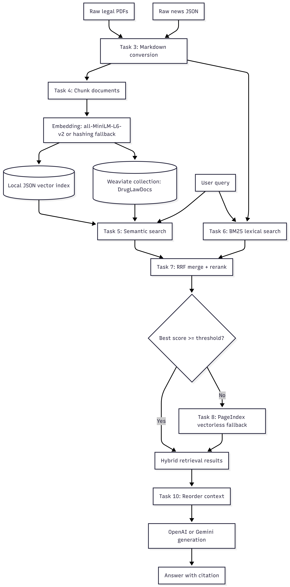

# Day08 RAG Pipeline Cohort 2

End-to-end RAG pipeline cho chủ đề pháp luật Việt Nam về ma túy và tin tức liên quan. Repo triển khai đầy đủ luồng cá nhân từ thu thập dữ liệu, chuẩn hóa, chunking, indexing, retrieval hybrid, PageIndex fallback, đến generation có citation.

## Trạng Thái

| Task | Module | Trạng thái | Ghi chú |
|---|---|---|---|
| 1 | `src/task1_collect_legal_docs.py` | Done | Có 3 PDF trong `data/landing/legal/` |
| 2 | `src/task2_crawl_news.py` | Done | Có 6 JSON bài báo trong `data/landing/news/` |
| 3 | `src/task3_convert_markdown.py` | Done | Có markdown trong `data/standardized/legal/` và `data/standardized/news/` |
| 4 | `src/task4_chunking_indexing.py` | Done | Recursive chunking, embedding 384 dim, Weaviate hoặc local JSON fallback |
| 5 | `src/task5_semantic_search.py` | Done | Dense retrieval trên local vector index hoặc Weaviate |
| 6 | `src/task6_lexical_search.py` | Done | BM25 bằng `rank-bm25` |
| 7 | `src/task7_reranking.py` | Done | Local reranker, MMR, RRF |
| 8 | `src/task8_pageindex_vectorless.py` | Done | PageIndex upload/query, cache doc_id tại `data/pageindex_documents.json` |
| 9 | `src/task9_retrieval_pipeline.py` | Done | Hybrid search + RRF + rerank + PageIndex fallback |
| 10 | `src/task10_generation.py` | Done | Citation generation với OpenAI/Gemini/fallback extractive |

## Kiến Trúc


## Dữ Liệu

| Vùng dữ liệu | Nội dung |
|---|---|
| `data/landing/legal/` | 3 tài liệu PDF pháp luật |
| `data/landing/news/` | 6 bài báo dạng JSON |
| `data/standardized/legal/` | Markdown chuyển đổi từ tài liệu pháp luật |
| `data/standardized/news/` | Markdown chuyển đổi từ bài báo |
| `data/vector_store/drug_law_docs.json` | Local vector index fallback, 781 chunks |
| `data/pageindex_documents.json` | Cache PageIndex `doc_id`, không chứa API key |

## Cài Đặt

```powershell
python -m venv venv
venv\Scripts\activate
pip install -r requirements.txt
```

Tạo `.env` từ `.env.example` và điền key cần dùng:

```env
PAGEINDEX_API_KEY=your_pageindex_key
GEMINI_API_KEY=your_gemini_key
OPENAI_API_KEY=your_openai_key
OPENAI_MODEL=gpt-4o-mini
GEMINI_MODEL=gemini-2.5-flash
```

Ghi chú Windows: repo dùng `pip-system-certs` để Python `requests` tin Windows certificate store khi gọi PageIndex/Gemini.

## Chạy Pipeline

Chạy lại Task 4 nếu cần tạo index local hoặc index vào Weaviate:

```powershell
venv\Scripts\python.exe src\task4_chunking_indexing.py
```

Upload/poll PageIndex:

```powershell
venv\Scripts\python.exe src\task8_pageindex_vectorless.py
```

Query retrieval pipeline:

```powershell
venv\Scripts\python.exe -c "from src.task9_retrieval_pipeline import retrieve; print(retrieve('hình phạt ma túy', 3))"
```

Generate câu trả lời có citation:

```powershell
venv\Scripts\python.exe -c "from src.task10_generation import generate_with_citation; print(generate_with_citation('Hình phạt tàng trữ ma túy?', 3)['answer'])"
```

## Weaviate Local Tùy Chọn

Pipeline hiện chạy được bằng local JSON fallback. Nếu muốn bật Weaviate local, tạo `docker-compose.yml`:

```yaml
services:
  weaviate:
    image: cr.weaviate.io/semitechnologies/weaviate:1.37.4
    command: ["--host", "0.0.0.0", "--port", "8080", "--scheme", "http"]
    ports:
      - "8080:8080"
      - "50051:50051"
    volumes:
      - weaviate_data:/var/lib/weaviate
    restart: on-failure:0
    environment:
      AUTHENTICATION_ANONYMOUS_ACCESS_ENABLED: "true"
      PERSISTENCE_DATA_PATH: "/var/lib/weaviate"
      CLUSTER_HOSTNAME: "node1"

volumes:
  weaviate_data:
```

Sau đó chạy:

```powershell
docker compose up -d
venv\Scripts\python.exe -c "import weaviate; c=weaviate.connect_to_local(); print(c.is_ready()); c.close()"
venv\Scripts\python.exe src\task4_chunking_indexing.py
```

## Kiểm Thử

Chạy toàn bộ test cá nhân:

```powershell
venv\Scripts\python.exe -m pytest tests/test_individual.py -v
```

Chạy các task retrieval/generation:

```powershell
venv\Scripts\python.exe -m pytest tests/test_individual.py::TestTask8 tests/test_individual.py::TestTask9 tests/test_individual.py::TestTask10 -v
```

Kết quả gần nhất với network PageIndex thật: `9 passed` cho Task 8-10.

## Bài Tập Nhóm

Xem [group_project/README.md](group_project/README.md) để biết kiến trúc nhóm, phân công và hướng dẫn evaluation.
