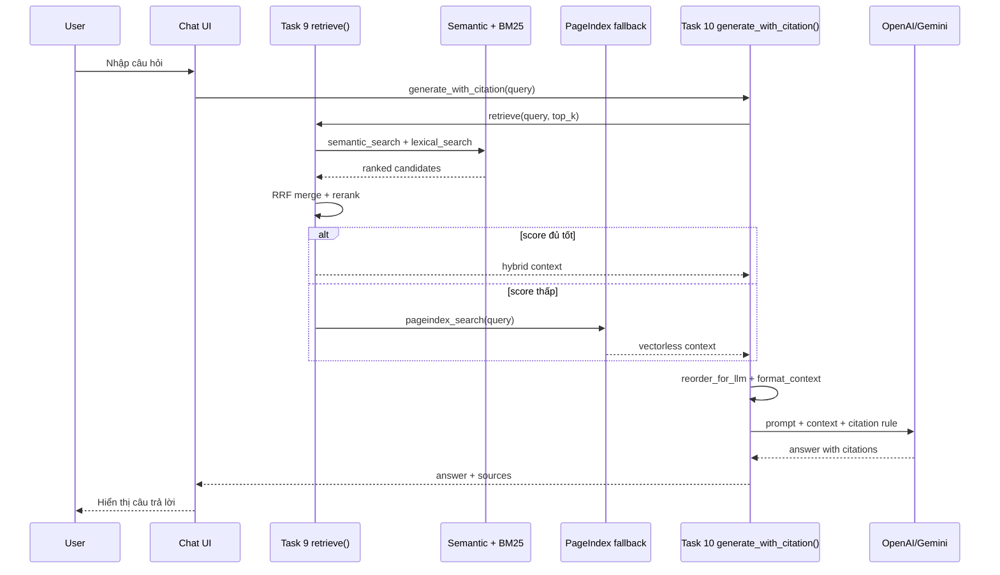

# Group Project - RAG Chatbot & Evaluation

Nhóm xây dựng hệ thống RAG trả lời câu hỏi về pháp luật Việt Nam liên quan đến ma túy và tin tức liên quan, có citation và có pipeline đánh giá.
# Group Project - RAG Chatbot & Evaluation

Nhóm xây dựng hệ thống RAG trả lời câu hỏi về pháp luật Việt Nam liên quan đến ma túy và tin tức liên quan, có citation và có pipeline đánh giá.

## Mục Tiêu

1. Tích hợp pipeline cá nhân thành retrieval/generation thống nhất.
2. Cung cấp chatbot hoặc API demo cho câu hỏi pháp luật/tin tức.
3. Trả lời có citation dựa trên nguồn retrieved.
4. Đánh giá RAG bằng golden dataset và so sánh A/B config.
1. Tích hợp pipeline cá nhân thành retrieval/generation thống nhất.
2. Cung cấp chatbot hoặc API demo cho câu hỏi pháp luật/tin tức.
3. Trả lời có citation dựa trên nguồn retrieved.
4. Đánh giá RAG bằng golden dataset và so sánh A/B config.

## Kiến Trúc Hệ Thống

```mermaid
flowchart LR
    U[User] --> UI[Chat UI: Streamlit/Chainlit]
    UI --> G[Generation: Task 10]
    G --> R[Retrieval Pipeline: Task 9]

    R --> S[Semantic Search: Task 5]
    R --> L[Lexical BM25: Task 6]
    S --> M[RRF Merge + Rerank: Task 7]
    L --> M
    M --> C{Score threshold}
    C -->|Good| CTX[Context chunks]
    C -->|Low confidence| PI[PageIndex fallback: Task 8]
    PI --> CTX

    CTX --> RE[Reorder context]
    RE --> LLM[OpenAI/Gemini]
    LLM --> ANS[Answer with citations]
    ANS --> UI

    EVAL[Evaluation Pipeline] --> R
    EVAL --> G
    GOLDEN[Golden Dataset] --> EVAL
    EVAL --> REPORT[Results report]
```mermaid
flowchart LR
    U[User] --> UI[Chat UI: Streamlit/Chainlit]
    UI --> G[Generation: Task 10]
    G --> R[Retrieval Pipeline: Task 9]

    R --> S[Semantic Search: Task 5]
    R --> L[Lexical BM25: Task 6]
    S --> M[RRF Merge + Rerank: Task 7]
    L --> M
    M --> C{Score threshold}
    C -->|Good| CTX[Context chunks]
    C -->|Low confidence| PI[PageIndex fallback: Task 8]
    PI --> CTX

    CTX --> RE[Reorder context]
    RE --> LLM[OpenAI/Gemini]
    LLM --> ANS[Answer with citations]
    ANS --> UI

    EVAL[Evaluation Pipeline] --> R
    EVAL --> G
    GOLDEN[Golden Dataset] --> EVAL
    EVAL --> REPORT[Results report]
```

## Thành Phần Chính

| Thành phần | File/Thư mục | Vai trò |
|---|---|---|
| Data landing | `data/landing/` | PDF pháp luật và JSON bài báo gốc |
| Standardized data | `data/standardized/` | Markdown sau chuyển đổi |
| Vector index | `data/vector_store/drug_law_docs.json` | Local dense index fallback |
| PageIndex cache | `data/pageindex_documents.json` | PageIndex document IDs, không chứa secret |
| Retrieval | `src/task9_retrieval_pipeline.py` | Hybrid retrieval + fallback |
| Generation | `src/task10_generation.py` | Reorder context + citation answer |
| Golden dataset | `group_project/evaluation/golden_dataset.json` | Bộ câu hỏi đánh giá |
| Eval script | `group_project/evaluation/eval_pipeline.py` | Chạy evaluation |
| Eval report | `group_project/evaluation/results.md` | Báo cáo kết quả |
## Thành Phần Chính

| Thành phần | File/Thư mục | Vai trò |
|---|---|---|
| Data landing | `data/landing/` | PDF pháp luật và JSON bài báo gốc |
| Standardized data | `data/standardized/` | Markdown sau chuyển đổi |
| Vector index | `data/vector_store/drug_law_docs.json` | Local dense index fallback |
| PageIndex cache | `data/pageindex_documents.json` | PageIndex document IDs, không chứa secret |
| Retrieval | `src/task9_retrieval_pipeline.py` | Hybrid retrieval + fallback |
| Generation | `src/task10_generation.py` | Reorder context + citation answer |
| Golden dataset | `group_project/evaluation/golden_dataset.json` | Bộ câu hỏi đánh giá |
| Eval script | `group_project/evaluation/eval_pipeline.py` | Chạy evaluation |
| Eval report | `group_project/evaluation/results.md` | Báo cáo kết quả |

## Phân Công Công Việc

| Thành viên | MSSV | Nhiệm vụ | Trạng thái |
|---|---|---|---|
| Nguyễn Quang Minh | 2A202600816 | Chatbot/RAG integration | Done |
| Nguyễn Tuấn Dũng | 2A202600848 | Evaluation pipeline | Done |
| Cần cập nhật | Cần cập nhật | UI polish, demo script, README final review | Pending |
| Cần cập nhật | Cần cập nhật | Golden dataset mở rộng 15+ Q&A | Pending |

## Luồng Retrieval & Generation



## Cài Đặt

Từ root repo:

```powershell
python -m venv venv
venv\Scripts\activate
|---|---|---|---|
| Nguyễn Quang Minh | 2A202600816 | Chatbot/RAG integration | Done |
| Nguyễn Tuấn Dũng | 2A202600848 | Evaluation pipeline | Done |
| Cần cập nhật | Cần cập nhật | UI polish, demo script, README final review | Pending |
| Cần cập nhật | Cần cập nhật | Golden dataset mở rộng 15+ Q&A | Pending |

## Luồng Retrieval & Generation


## Cài Đặt

Từ root repo:

```powershell
python -m venv venv
venv\Scripts\activate
pip install -r requirements.txt
```

Tạo `.env`:

```env
PAGEINDEX_API_KEY=your_pageindex_key
GEMINI_API_KEY=your_gemini_key
OPENAI_API_KEY=your_openai_key
OPENAI_MODEL=gpt-4o-mini
GEMINI_MODEL=gemini-2.5-flash
```

## Chạy Demo Pipeline

Chạy retrieval:

```powershell
venv\Scripts\python.exe -c "from src.task9_retrieval_pipeline import retrieve; print(retrieve('hình phạt ma túy', 3))"
```

Chạy generation có citation:

```powershell
venv\Scripts\python.exe -c "from src.task10_generation import generate_with_citation; print(generate_with_citation('Hình phạt tàng trữ ma túy?', 3)['answer'])"
```

Chạy PageIndex upload/query:

```powershell
venv\Scripts\python.exe src\task8_pageindex_vectorless.py
```

Tạo `.env`:

```env
PAGEINDEX_API_KEY=your_pageindex_key
GEMINI_API_KEY=your_gemini_key
OPENAI_API_KEY=your_openai_key
OPENAI_MODEL=gpt-4o-mini
GEMINI_MODEL=gemini-2.5-flash
```

## Chạy Demo Pipeline

Chạy retrieval:

```powershell
venv\Scripts\python.exe -c "from src.task9_retrieval_pipeline import retrieve; print(retrieve('hình phạt ma túy', 3))"
```

Chạy generation có citation:

```powershell
venv\Scripts\python.exe -c "from src.task10_generation import generate_with_citation; print(generate_with_citation('Hình phạt tàng trữ ma túy?', 3)['answer'])"
```

Chạy PageIndex upload/query:

```powershell
venv\Scripts\python.exe src\task8_pageindex_vectorless.py
```

## Evaluation

Deliverables hiện có:

| File | Trạng thái | Ghi chú |
|---|---|---|
| `group_project/evaluation/golden_dataset.json` | Started | Cần mở rộng lên tối thiểu 15 Q&A |
| `group_project/evaluation/eval_pipeline.py` | Started | Script đánh giá |
| `group_project/evaluation/results.md` | Started | Cần điền metric thật sau khi chạy eval |

Metrics cần báo cáo:

| Metric | Ý nghĩa |
|---|---|
| Faithfulness | Câu trả lời có bám context không |
| Answer Relevance | Câu trả lời có đúng câu hỏi không |
| Context Recall | Retriever có lấy đủ evidence không |
| Context Precision | Context lấy về có hữu ích không |

Config A/B đề xuất:

| Config | Mô tả |
|---|---|
| A | Hybrid retrieval: semantic + BM25 + RRF + rerank + PageIndex fallback |
| B | Dense-only: semantic search không BM25/rerank |

Chạy test liên quan:

```powershell
venv\Scripts\python.exe -m pytest tests/test_individual.py::TestTask8 tests/test_individual.py::TestTask9 tests/test_individual.py::TestTask10 -v
```

Kết quả gần nhất: `9 passed` cho Task 8-10 khi có network PageIndex.

## Checklist Trước Khi Demo

- [x] Dữ liệu pháp luật đã thu thập.
- [x] Bài báo đã crawl.
- [x] Markdown đã chuẩn hóa.
- [x] Local vector index đã tạo.
- [x] PageIndex documents đã upload và ready.
- [x] Retrieval pipeline chạy được.
- [x] Generation có citation chạy được với OpenAI/Gemini hoặc fallback extractive.
- [x] Golden dataset đủ 15+ Q&A.
- [x] `results.md` có bảng điểm evaluation thật.
- [x] UI Streamlit/Chainlit được thêm nếu nhóm chọn chatbot demo.

## Ghi Chú

Không commit `.env` hoặc bất kỳ API key nào. File `data/pageindex_documents.json` chỉ chứa `doc_id`, tên file, trạng thái xử lý và số trang để tái sử dụng PageIndex index.
